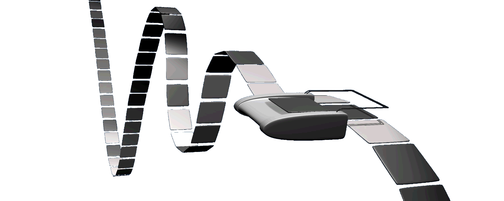
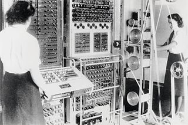
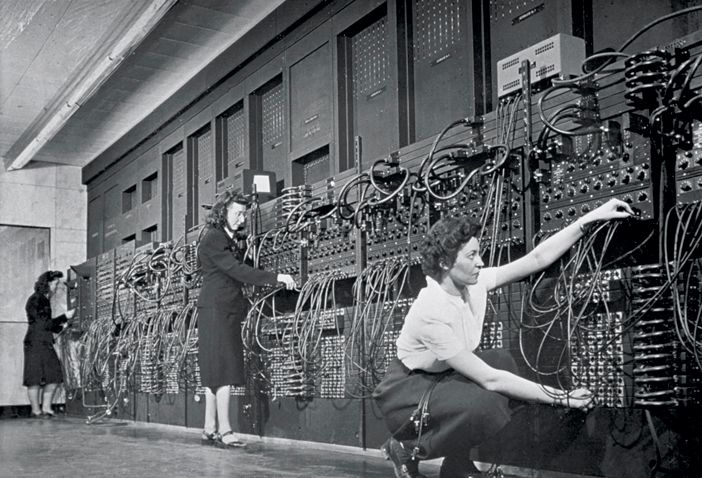
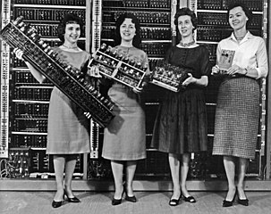

class: title-slide, right, top
background-image: url(img/arquitectura-vonneumann.jpg)
background-position: center
background-size: 450px

.right-column[
# `r rmarkdown::metadata$title`

`r rmarkdown::metadata$author` 
`r rmarkdown::metadata$institute`
]

.palegrey[.left[.footnote[<small>Diagrama de la [arquitectura de von Neumann](https://es.wikipedia.org/wiki/Arquitectura_de_Von_Neumann). Fuente: [David Strigoi](https://commons.wikimedia.org/wiki/File:Arquitecturaneumann.jpg).</small>]]]

---

# Contenidos

- ### Características generales de las computadoras

- ### Historia de la computadora
    - #### Primeras computadoras
    - #### La máquina de Turing
    - #### Computadoras eletrónicas

- ### La arquitectura de von Neumann

---

# Computadoras

.pull-left[
- Una computadora es una **máquina** que ejecuta automáticamente **secuencias de cálculos y operaciones lógicas**, llamadas **comandos** o **instrucciones**. Estas secuencias son denominadas **programas**.

- Los programas reciben un conjunto de datos de **entrada**, que **procesan** mediante los comandos, para enviar los resultados a los dispositivos de **salida**.

- En las computadoras modernas, es posible cambiar los programas que ejecutan sin necesidad de alterar sus componentes físicos.
]

.pull-right[

<figure>
  
  <figcaption>
    <small>
      Imagen de <a href="https://unsplash.com/@lorenzoherrera?utm_source=unsplash&utm_medium=referral&utm_content=creditCopyText">Lorenzo Herrera</a> en <a href="https://unsplash.com/s/photos/computer?utm_source=unsplash&utm_medium=referral&utm_content=creditCopyText">Unsplash</a>.
    </small>
  </figcaption>
</figure>

<figure>
  
  <figcaption>
    <small>
      Imagen de <a href="https://unsplash.com/@lucabravo?utm_source=unsplash&utm_medium=referral&utm_content=creditCopyText">Luca Bravo</a> en <a href="https://unsplash.com/s/photos/computer?utm_source=unsplash&utm_medium=referral&utm_content=creditCopyText">Unsplash</a>.
    </small>
  </figcaption>
</figure>
]

---

# Computadoras digitales binarias

.pull-left[
- Las computadoras modernas están construídas con base en [circuitos integrados (CI)](https://es.wikipedia.org/wiki/Circuito_integrado), también llamados *chips* o *microchips*.

- Los CI procesan [información digital](https://es.wikipedia.org/wiki/Se%C3%B1al_digital) (que usa valores discretos), la cual generalmente es binaria (i.e. de dos valores).

- Una computadora, usa dos estados correspondientes a **dos niveles de tensión eléctrica: alto y bajo**. Estos estados se representan con: **0 y 1**. Esto facilita la aplicación de la [lógica binaria](https://es.wikipedia.org/wiki/L%C3%B3gica_binaria) y de la [aritmética binaria](https://es.wikipedia.org/wiki/Sistema_binario).
]

.pull-right[
<figure>
  
  <figcaption>
    <small>
      Imagen de <a href="https://unsplash.com/@slavudin?utm_source=unsplash&utm_medium=referral&utm_content=creditCopyText">Slejven Djurakovic</a> disponible en <a href="https://unsplash.com/s/photos/chip?utm_source=unsplash&utm_medium=referral&utm_content=creditCopyText">Unsplash</a>.
    </small>
  </figcaption>
</figure>

<figure>
  
  <figcaption>
    <small>
      Imagen de <a href="https://unsplash.com/@yasin?utm_source=unsplash&utm_medium=referral&utm_content=creditCopyText">Yasin Hasan</a> disponible en <a href="https://unsplash.com/s/photos/alarm-clock-digital?utm_source=unsplash&utm_medium=referral&utm_content=creditCopyText">Unsplash</a>.
    </small>
  </figcaption>
</figure>
]

---

# Historia de la computadora

--
- ### Durante el siglo XVII, varios matemáticos construyeron calculadoras mecánicas experimentales capaces de sumar, restar, multiplicar y dividir.  

--
- ### En la primera mitad del siglo XIX, **Charles Babbage** diseñó la [máquina analítica](https://es.wikipedia.org/wiki/M%C3%A1quina_anal%C3%ADtica), considerada la primera computadora programable. Era una máquina de vapor que contaba con una unidad central de procesamiento, memoria y una impresora.  

--
- ### Por esa misma época, **Ada Lovelace** elaboró sobre el trabajo de Babbage e introdujo varios conceptos utilizados actualmente en programación. Describió como la máquina analítica podría utilizarse para representar información no numérica, como texto, gráficos o música. Es considerada la **primera programadora de computadoras**.  

---

# Historia de la computadora

--
- ### A mediados del siglo XIX, **George Boole** introdujo el [álgebra booleana](https://es.wikipedia.org/wiki/%C3%81lgebra_de_Boole), la cual trata sobre las operaciones (ej. AND, OR, NOT) en valores lógicos (Verdadero o Falso). Esto constituye el fundamente teórico en el que se basan los circuitos digitales, además de tener múltiples aplicaciones en matemáticas, como en teoría de conjuntos.

--
- ### En la primera mitad del XX, **Claude Shannon** demostró como el álgebra booleana podía ser aplicada al diseño de circuitos. Es considerado el padre de la [teoría de información](https://es.wikipedia.org/wiki/Teor%C3%ADa_de_la_informaci%C3%B3n), la cual estudia la cuantificación, el almacenamiento y la comunicación de información. También sentó las bases matemáticas de la criptografía.

---

# La máquina de Turing

--
- ### Durante el período entre las guerras mundiales, **Allan Turing** desarrolló la [máquina de Turing](https://es.wikipedia.org/wiki/M%C3%A1quina_de_Turing), un dispositivo teórico que manipula símbolos de una cinta de acuerdo con una tabla de reglas.

--
- ### La máquina de Turing simula el funcionamiento de un algoritmo y los conceptos de **entrada, procesamiento y salida**.

--
- ### La mayoría de las computadoras modernas están basadas en el concepto de la máquina de Turing.

---

# Representación artística de la máquina de Turing

--
<figure>
  
  <figcaption>
    <small>
      Representación artística de una máquina de Turing. Imagen de <a href="https://commons.wikimedia.org/wiki/File:Turing_Machine.png">Porao en Wikimedia</a>.
    </small>
  </figcaption>
</figure>

---

# Primeras computadoras electrónicas

--
- ### Con base en las ideas de Turing, las computadoras [Colossus](https://es.wikipedia.org/wiki/Colossus) fueron construídas durante la Segunda Guerra Mundial en el Reino Unido para descifrar mensajes codificados. A pesar de que se consideran de las primeras computadoras digitales electrónicas programables, su programación se realizaba a través de interruptores y enchufes, y no con un [programa almacenado](https://es.wikipedia.org/wiki/Computador_de_programa_almacenado).

--
- ### [ENIAC (Electronic Numerical Integrator and Computer)](https://es.wikipedia.org/wiki/ENIAC) es considerada la primera computadora programable digital de propósito general. Era capaz de seguir el modelo de la máquina de Turing, por lo que era [Turing-completa](https://es.wikipedia.org/wiki/Turing_completo). Fue inicialmente diseñada para calcular tablas de tiro de artillería para el ejército de Estados Unidos. Su construcción se completó en 1946. Podía resolver 5000 sumas o 300 multiplicaciones en 1 segundo.

---

# Primeras computadoras electrónicas

.pull-left[
<figure>
  
  <figcaption>
    <small>
      Computador Colossus operado por integrantes del <em>Women's Royal Naval Service (WRNS)</em>. Imagen de <a href="https://commons.wikimedia.org/wiki/File:Colossus.jpg">autor desconocido en Wikimedia</a>.
    </small>
  </figcaption>
</figure>
]

.pull-righ[
<figure>
  
  <figcaption>
    <small>
      ENIAC programado por Glen Beck y Betty Snyder. Imagen del <a href="https://commons.wikimedia.org/wiki/File:Eniac.jpg">Ejército de Estados Unidos en Wikimedia</a>.
    </small>
  </figcaption>
</figure>
]

---

# Primeras computadoras electrónicas

.pull-left[
<figure>
  
  <figcaption>
    <small>
      ENIAC programado por Jean Jennings, Marlyn Wescoff y Ruth Lichterman. Imagen del Ejército de Estados Unidos.
    </small>
  </figcaption>
</figure>
]

.pull-righ[
<figure>
  
  <figcaption>
    <small>
      Programadoras de ENIAC mostrando algunos de sus componentes. Imagen del <a href="https://commons.wikimedia.org/wiki/File:Women_holding_parts_of_the_first_four_Army_computers.jpg">Ejército de Estados Unidos en Wikimedia</a>.
    </small>
  </figcaption>
</figure>
]

---

# La arquitectura de von Neumann

--
- ### En 1945, **John von Neumann** propuso un concepto conocido como **programa almacenado**, en el cual los datos y los programas se almacenan en una estructura llamada **memoria**, separada del hardware que ejecuta las instrucciones.

--
- ### Este modelo permite que las computadoras sean más fáciles de reprogramar y es conocido actualmente como [arquitectura de von Neumann](https://es.wikipedia.org/wiki/Arquitectura_de_Von_Neumann).

---

# Diagrama de la arquitectura de von Neumann

<figure>
  
  <figcaption>
    <small>
      Diagrama de la arquitectura de von Neumann. Imagen de <a href="https://commons.wikimedia.org/wiki/File:Arquitecturaneumann.jpg">David Strigoi en Wikimedia</a>.
    </small>
  </figcaption>
</figure>
